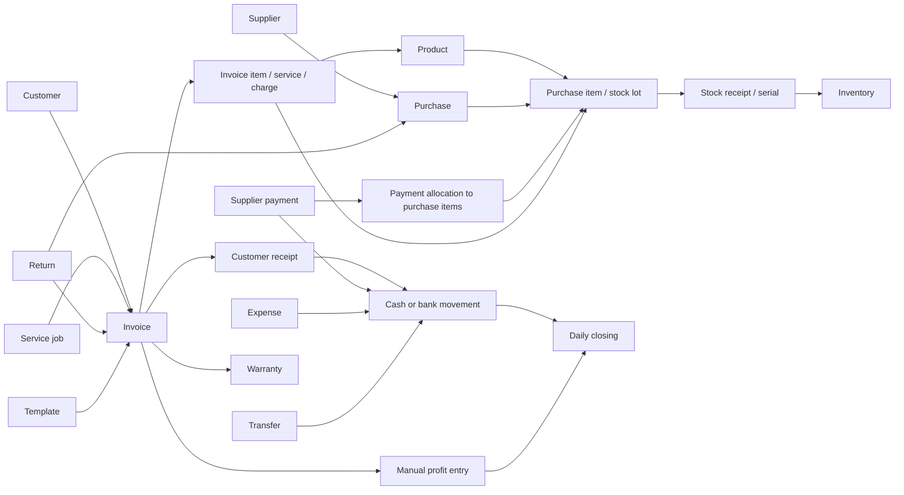

# iTech shop workflow and backend reference

Status: business UI prototype with Atlas authentication and private-file backend foundation. This document records the agreed workflow, current UI behaviour, proposed record relationships and decisions to resolve before backend development. It is not a completed database design or tax-compliance specification.

## 1. Navigation and terminology

- Keep **Inventory** and **Purchases** in one **Stock & Purchases** group. Inventory answers “what can I sell?” Purchases answers “what did I buy, from whom, and what do I owe?” Combining their data into one record would lose repeat purchase prices, supplier credit and individual receipts.
- **Cash & account** replaces the separate daily register and expense/transfer navigation. It has Money in, Money out and Cash ↔ account actions.
- **Daily closing** is the second money screen: daily reports, manual profit, reconciliation and locking. Dues remains a collection/payment worklist linked to the same invoices and payments.
- There is physical **Cash** and exactly one **Bank account**. GPay/UPI, card and bank transfer receipts belong to this bank balance. A payment method is not another account.
- **Stock holds** is optional. It reduces available stock, not physical stock, and does not create an invoice, receipt or supplier payment.

## 2. Record relationships

### Proposed backend records

| Record | Important fields and relations |
|---|---|
| Product | ID, SKU, name, category, condition, specifications, HSN, default taxBasisPoints, default sellingPricePaise and costPaise, priceEntryMode, warranty, isSerialTracked, low reorder level, preferredSupplierId (optional). Does not store authoritative stock or serial arrays. |
| Stock lot (`stockLots`) | Stable lot ID, tenantId, productId, lotType (`Opening` / `Purchase`), originalQuantity, quantityRemaining, costPaise, receivedDate, reference. |
| Serial unit (`serialUnits`) | Tenant-scoped serial unit ID, tenantId, productId, serialNormalized, status (`InStock`, `Sold`, `Reserved`, `Defective`), stockLotId, stockMovementId, createdDate. Compound unique index on `{tenantId: 1, serialNormalized: 1}`. |
| Stock movement (`stockMovements`) | Movement ID, tenantId, productId, lotId, deltaQuantity, reason, reference, date, createdDate. |
| Opening receivables (`openingReceivables`) | ID, tenantId, customerId, date, description, amountPaise, remainingAmountPaise, status. Allocatable source documents for later customer receipts. |
| Opening payables (`openingPayables`) | ID, tenantId, supplierId, date, description, amountPaise, remainingAmountPaise, status. Allocatable source documents for later supplier payments. |
| Service catalogue | ID, name, category, description, SAC, ratePaise, taxBasisPoints, warranty, active status. Has no stock quantity. |
| Customer | ID, name, phone, email, type, GST, billing and shipping address, notes, details, status (`Active`/`Archived`). Non-blocking warnings for duplicate phone numbers. |
| Supplier | ID, business/contact/GST details, address, payment terms, status (`Active`/`Archived`). Purchase dues are derived from bills, credits and allocations. |
| Purchase | ID, supplier ID, order date, supplier invoice reference, due date, status, receipt date(s), item snapshots, price mode, totals. Receipt and payment status are different fields. |
| Purchase item / stock lot | Stable item ID, product ID, quantity ordered/received/returned, serials, price/tax/discount snapshot, credited and allocated amounts. One product may occur in many purchases and at different costs. |
| Invoice | ID/number, kind (sale/service), customer ID, immutable customer/company/address snapshots, date/due date, selected template/version, inclusive/exclusive mode, item/charge snapshots, totals, source quotation/job/enquiry. |
| Invoice item | Stable line ID, product/service/charge kind, description, HSN/SAC, quantity, rate, tax, discount type/value, tax components, serials, purchase-lot allocation, warranty and photos. |
| Payment | ID, date/time, direction, account ID, method, amount, counterparty, reason/reference, linked document and idempotency key. Store exact minor-unit amounts. |
| Payment allocation | Payment ID, purchase item ID or customer invoice ID, allocated amount. One supplier payment may settle several products and bills. |
| Return / credit | Original document/line/serial, quantity, credit value, stock disposition, date, refund due/paid and manual profit adjustment. Credit and refund are distinct events. |
| Warranty | Invoice line/serial ID, customer, provider, start/end, notes/photos, claim history. Editing a claim does not rewrite the invoice. |
| Daily closing | Business date, opening balances, receipts/outgoings/transfers, expected/actual cash and bank, discrepancies, manual profit completion, holiday flag, closer/time, immutable snapshot/version. |
| Invoice template | ID, unique display name, currentRevision, printed title, fields allowlist, column configuration, paper, orientation, fontSize, borders, striped, accent, logoPosition, footer, status. |
| Account movements (`accountMovements`) | Movement ID, tenantId, account (`Cash` / `Bank`), direction (`In` / `Out`), amountPaise, date, reason, reference, createdAt, createdBy. Used for physical cash and bank opening balances as well as transactional ledger entries. |
| Template revision (`templateRevisions`) | Immutable historical snapshot ID, tenantId, templateId, revision number, complete configuration snapshot, createdBy, createdAt. Historical invoices point to exact revision. |
| Audit history (`auditHistory`) | Append-only tenant-scoped audit entry: ID, tenantId, action, entityType, entityId, actor, before/after sanitized snapshot (passwords, hashes and secrets excluded), timestamp. |

### Opening Setup Lifecycle (Implemented in Phase 2)
Opening setup operates with a strict Draft → Finalized lifecycle:
1. **Draft Stage**: Edits to cutoff date, cash/bank ledger opening balances, opening stock lots with serial numbers, customer opening receivables, and supplier opening payables are stored as a draft in `openingSetups`. Draft saves post zero stock movements, zero serial units, and zero financial transactions.
2. **Atomic Finalization**: Once reconciled, finalization executes within a single MongoDB transaction:
   - Loads the previously persisted draft directly from `openingSetups` (rejects unpersisted changes or missing drafts).
   - Validates all references within `{tenantId, _id}`.
   - Inserts `stockLots` and `stockMovements` for opening inventory.
   - Inserts individual `serialUnits` records enforcing intra-tenant uniqueness.
   - Inserts allocatable `openingReceivables` and `openingPayables`.
   - Posts opening cash and bank balance ledger source records directly into `accountMovements` (`direction: 'In'`).
   - Records tenant audit entry.
   - Marks opening setup as `Finalized`, permanently locking it against subsequent edits or backdating.
3. **Lock & Adjustments**: Any post-finalization corrections must occur through current-day audited adjustment workflows in Phase 5.
4. **Stock Adjustment Idempotency**: Stock adjustments support an `idempotencyKey` backed by a partial unique compound index `{tenantId: 1, idempotencyKey: 1}` on `stockMovements`, ensuring retried operations never duplicate stock.
5. **Canonical API-to-Domain Mapping**: All backend entities are translated uniformly into frontend domain shapes with `id: _id` via `lib/mappers.ts`, preserving explicit zero values (`tax: 0`, `low: 0`, `warranty: 0`).

## 3. Money and stock rules

1. **Unpaid sale:** invoice total increases customer dues; stock decreases. Cash and bank remain unchanged.
2. **Paid or partly paid sale:** issue the invoice and record the entered payment rows together. Receipts increase the selected account, reduce that invoice’s due and appear in customer history and daily register once. This applies equally to service and zero-tax invoices.
3. **Later collection:** select the customer and outstanding invoice from Money in, Dues or the invoice. Never create another sale to settle an old invoice.
4. **Other money in:** owner contribution or a clearly described other receipt increases the account but does not create sales or manual invoice profit.
5. **Purchase receipt:** stock increases whether paid or unpaid. A supplier payment is a separate linked event. The prototype can record a payment at creation, or later against selected items.
6. **Supplier payment:** allocate amounts against selected purchase products. Update purchase item balances, supplier profile, Dues and account movements together. Do not also post this as an operating expense.
7. **Shop expense:** cash/bank decreases and daily expense totals increase. It does not settle a supplier purchase bill unless recorded through the supplier-payment workflow.
8. **Transfer:** Cash → Bank subtracts cash and adds bank; Bank → Cash does the reverse. Combined funds, sales and profit stay unchanged. Reject transfers above source funds in the prototype.
9. **Customer paid vs supplier paid:** show both independently. A customer may pay for stock bought on supplier credit, or buy on credit stock already fully paid to the supplier.
10. **Supplier product status:** paid/partly paid/unpaid refers to the selected purchase item or lot, not every unit of that product in the store. A partial amount does not identify which physical unit was paid.
11. **Source matching:** serialized sales can match original purchase serials. For quantity-tracked stock, select a source purchase. The UI displays “Opening stock / purchase not linked” if no reliable link exists. It must not guess that all inventory is paid.
12. **Atomic actions:** invoice + stock + warranty + receipts, or a multi-bill supplier settlement, must all succeed or none should. Server transactions and idempotency must enforce this under concurrent use.

The current one-bank mock opening balance combines the previous two mock banks (₹2,40,000), preserving total funds. This is demo seed migration, not a real bank reconciliation.

## 4. Shared GST arithmetic and invoice charges

`lib/gst.ts` is the shared calculator used by product previews, invoice/purchase rows and document totals.

- Gross entered line value = quantity × rate.
- Percentage discount = gross × percentage / 100. Amount discount = the entered amount **for the whole line**, not per unit. Apply one discount before tax.
- Inclusive: total after discount already contains GST. Taxable base = total / (1 + GST rate / 100); GST is the difference.
- Exclusive: taxable base is the discounted amount; GST = base × rate / 100; total = base + GST.
- Prototype rounding is **per line to 2 decimal places**. Inclusive tax is computed as total minus rounded base, so the displayed values add up. CGST is half tax rounded to paise; SGST takes the remaining paise. The component difference can be one paisa on an odd tax amount.
- ₹5,000 inclusive at 18% → base ₹4,237.29, GST ₹762.71, total ₹5,000.00. ₹5,000 exclusive at 18% → base ₹5,000, GST ₹900, total ₹5,900.
- Quantity 2 × ₹1,000 with a ₹100 line discount, exclusive at 18% → base ₹1,900, GST ₹342, total ₹2,242.
- Shipping/other charges are explicit charge rows with their own editable amount, SAC/tax and discount. They participate in the same total and payment balance, but never move product stock or increase goods-unit totals.
- Changing the inclusive/exclusive selector **reinterprets the amount entered**. It does not silently rewrite every rate to preserve the total. The UI explains this.
- Product prices are saved as inclusive defaults; selecting a product in an exclusive document converts its default rate. Overrides belong to the document and do not change the product master.
- Reject non-finite/negative rates and quantities, discounts above 100% or above line value, invalid dates, negative payments and overpayments. Zero tax and zero final line amounts are valid where intentionally configured.
- Prorate a fixed line discount when valuing a partial return. Cumulative credit cannot exceed the original discounted/taxed value. A shipping refund needs an explicit credit policy; do not invent returned stock for it.

Reference for pricing behaviour: [Zoho Invoice — Tax inclusive/exclusive preferences](https://www.zoho.com/us/invoice/kb/taxes/tax-preferences.html). The prototype’s exact rounding policy above is an explicit implementation choice, not a claim that every billing application uses it.

### Tax decisions required before real billing

The UI and shared calculator support CGST/SGST for intra-state supply and IGST for inter-state sales and purchases. **Do not treat this as a complete statutory GST engine.** Obtain accountant-approved rules for place of supply and IGST, used-goods treatment, taxable services, freight/assembly classification, zero-rated/exempt/non-GST distinctions, credit notes, rounding, and any applicable e-invoice/e-way bill requirements. A ship-to state alone must not silently determine every tax rule. Template names and titles must not choose tax treatment. Production calculations should use decimal or minor-unit arithmetic, authoritative validation and versioned tax rules.

## 5. Daily closing and historical integrity

- Opening Cash/Bank = prior closed day’s closing. Expected closing = opening + incoming − outgoing, including the appropriate side of transfers.
- Count cash and reconcile the one bank account. Show actual minus expected until both differences are zero; never silently insert an adjustment to hide a mismatch.
- Enter manual whole-invoice profit for every sale/service, including non-GST entries. Blank is pending; zero or negative profit is a valid deliberate entry. Staff enter individual amounts; owner sees totals.
- Profit is separate from cash and supplier settlement. Paying a supplier must not subtract the entered invoice profit again.
- Close in date order after all profit entries and counts are complete. A closed date rejects new financial postings and profit changes.
- A later payment is dated in the open day, settles the old bill and appears in the current register. Closed daily reports use payments/credits up to their report date.
- A later return creates a new profit adjustment on the return date. Do not rewrite the original day’s manual profit.
- Holidays must have no business activity. Schedule then explicitly close the empty date with balances carried forward. If business occurs, remove its holiday schedule before posting.
- Production needs a controlled correction/reversal workflow, audit trail, authorised reopening policy if ever allowed, time zone and cutoff rules. UI role switching is only a mock; the server must enforce permissions and locks.

## 6. Invoice presentation and snapshots

- Select a template by its name while composing, and optionally another layout at printing. It is a presentation choice; sale/service category and GST remain separate.
- Company logo can be replaced/removed in Settings or the template editor; visibility and position are template settings.
- Bill to and Ship to are separate sections. Default shipping uses the billing address. A different ship-to address is captured on that invoice and is not a silent change to the customer’s master address.
- Capture company/customer/address/product/price/tax/discount snapshots at issue time. Master edits affect future documents. Issued invoice identity and financial values remain unchanged.
- Photos and logos in this prototype use browser object URLs. Backend storage must replace these with durable asset references, validate file size/type and enforce access controls. Refresh intentionally resets mock changes.

## 7. Remaining production decisions / edge-case checklist

- Partial delivery and multiple receipts against one purchase; supplier invoice versus purchase order and when a payable becomes due.
- Purchase advances, customer advances, overpayments/customer credits, refunds and allocations across multiple invoices. Prototype overpayment is blocked; it is not silently stored as a deposit.
- Lot/serial traceability for opening stock, quantity-tracked products, service parts and returns. Product-level labels must not substitute for actual lot allocation.
- Part-payment allocation after returns: credit can offset other items on the same bill. Preserve the actual credit event and its allocation rather than double counting it as another payment.
- Duplicate payment callbacks or double clicks, invoice numbering, duplicate supplier bill references and concurrent reservations/sales.
- Backdated entries in open periods can affect later available funds; define whether overdrafts are allowed and validate chronological account balances on the server.
- Credit-limit enforcement versus owner override. The UI displays the limit for review; production policy is not yet enforced.
- Service-estimate approval, warranty rework, outsourced repair charges, part returns and cancelled jobs. Parts are currently consumed at job issue, not again on service invoicing.
- Shipping charge refunds, whole-invoice discounts allocated across mixed tax rates, round-off adjustments and tax treatment of used stock. These need explicit rules before adding shortcuts.
- Returns after expiry of warranty, damaged/quarantined stock, replacement serials and supplier refund settlement.
- Audit before/after values, attachment retention, durable backups, access permissions, migration/opening balances and printed document versioning.

Do not add payroll, branches, barcode/labels, online cart, GST filing, offline mode or external messaging as part of this prototype. Resolve the above production decisions after the UI review, before implementing the corresponding backend operations.

## Atlas and company-isolation update — 11 September 2026

See DEVELOPMENT-PHASES.md for sequencing and production acceptance gates. Development uses a separate Atlas database, itech_dev. Better Auth collections: authUsers, authAccounts, authSessions, authVerifications and authRateLimits. Application foundation collections: tenants, files, rateLimits and approval audit. Collections are created as needed; business collections are introduced with their APIs.

Each auth user belongs to a server-assigned tenantId. A company and its user both require verified=true and disabled=false. Signup cannot set these protected fields. Every future business query, update, unique index, file reference, export and aggregation must be tenant-scoped. Never trust a tenantId received from the browser. Do not expose profitPasswordHash, login hashes, session tokens or secrets in business responses.

Files use random IDs with MongoDB ownership metadata and private tenant directories. Downloads recheck session and tenant ownership. Test companies were used to verify isolation; no real customer data was uploaded. Backups need both Atlas data and private binaries.

One ordinary shop permission level replaces the mock role switch. Profit totals use a separate password and expiring server-session permission. The mock UI gate and real API gate are currently separate because business screens remain demo-only. Individual profit visibility means a person may manually sum those values; this gate does not make that information mathematically secret.

Reports now export real XLSX/PDF, and invoice batches export ZIP containing PDFs and an XLSX index. Current direct PDF font supports Latin text; add embedded Unicode/Tamil fonts and production template pagination acceptance tests before real multilingual billing. Export filters must match displayed records; distinguish current dues from as-of-date balances. Customer returns use original invoice links for category/customer filtering, even when the original sale lies outside the return-date range.
